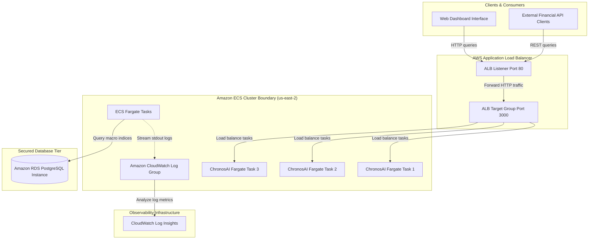

# ChronosAI Logical Architecture Specification

This document maps out the logical component relations, data pipelines, and security authorization boundaries established for Project ChronosAI.

## System Architecture Diagram

The diagram below details the end-to-end telemetry pathways and forecasting data integrations:

## Telemetry Pathways

1. **Macroeconomic Ingestion**: Data sources transmit commodity index changes, logistics score drops, and geopolitical indicators. Analytical processing models calculate GDP growth metrics.
2. **Log Collection**: Application stdout logs generated by containers are captured natively by the Fargate ECS container agent and streamed directly to Amazon CloudWatch logs.
3. **Database Security**: ECS tasks interact with a private Amazon RDS PostgreSQL database instance restricted via VPC security groups to prevent any outside exposure.
