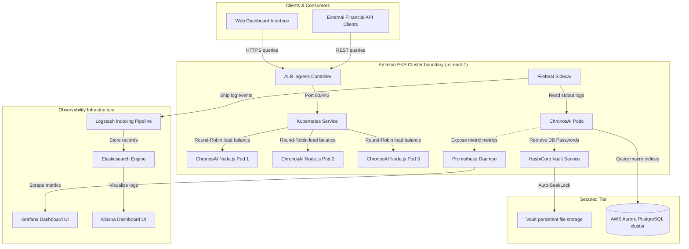

# ChronosAI Logical Architecture Specification

This document maps out the logical component relations, data pipelines, and security authorization boundaries established for Project ChronosAI.

## System Architecture Diagram

The diagram below details the end-to-end telemetry pathways and forecasting data integrations:

## Telemetry Pathways

1. **Macroeconomic Ingestion**: Data sources transmit commodity index changes, logistics score drops, and geopolitical indicators. Analytical processing models calculate GDP growth metrics.
2. **Scrape Route**: Prometheus pulls telemetry indicators from `/api/sim-metrics` every 5 seconds.
3. **Log Collection**: Container logs generated on `stdout` are read by Filebeat and piped to Logstash for indexing.
4. **Secret Rotations**: Credentials are recovered during pod startup via JWT vault authentication. If suspicious intrusion signatures are raised, Vault seals itself.
